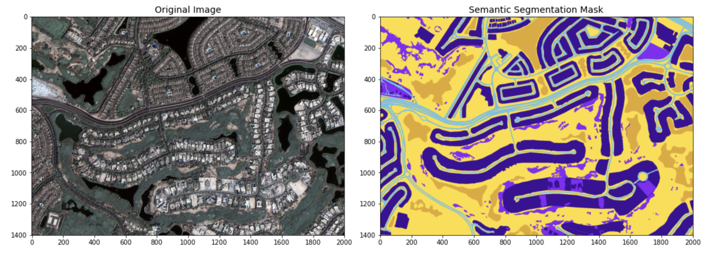

  

# Semantic Segmentation of Aerial Images: A Comparison of U-Net and SegNet Approaches

This project presents a comprehensive comparative analysis of two models, U-Net and SegNet, applied to semantic segmentation of aerial imagery of Earth. It includes a detailed implementation pipeline, covering model training, testing, and an in-depth discussion of the results. This work was created as part of the Vision and Cognitive Systems course at the University of Padova.

Group Members: 
- Marija Cveevska 
- Isikay Karakus

The dataset used in this study can be accessed on Kaggle: [Semantic Segmentation of Aerial Imagery](https://www.kaggle.com/datasets/humansintheloop/semantic-segmentation-of-aerial-imagery/data).

## Segmentation Models

Semantic segmentation models are designed to classify each pixel in an image into one of several predefined categories, enabling detailed analysis of visual data. Two prominent deep learning models used for semantic segmentation are U-Net and SegNet.

### U-Net

U-Net is a convolutional neural network architecture specifically developed for biomedical image segmentation but has since been widely adopted for various segmentation tasks, including aerial imagery. It features a symmetric encoder-decoder structure with skip connections that directly link corresponding layers of the encoder and decoder. These skip connections help in preserving spatial information that is often lost during the down-sampling process in the encoder, thereby improving the segmentation accuracy. U-Net’s architecture is particularly effective for segmentation tasks where the exact localization of structures is crucial.

#### U-Net Architecture

  

### SegNet

SegNet is another popular deep learning model for semantic segmentation. It is characterized by its encoder-decoder architecture, similar to U-Net, but with a distinct approach to the up-sampling process. In SegNet, the encoder network is identical to the convolutional layers of the VGG16 network, which captures high-level features from the input image. The decoder network then uses pooling indices computed in the max-pooling step of the corresponding encoder to perform up-sampling. This method ensures that spatial resolution is maintained, leading to more accurate and fine-grained segmentations. SegNet is known for its efficiency in memory and computational resource usage, making it suitable for real-time applications.

#### SegNet Architecture

  

## Dataset

In the dataset used for our experiments, each class is labelled with a specific colour to facilitate semantic segmentation. These classes and their corresponding colours are as follows:

- **Building**: `#3C1098` - Represented by a deep purple colour, buildings are distinctly marked to differentiate them from other structures and land features.
- **Land (unpaved area)**: `#8429F6` - This shade of purple is used to highlight unpaved areas such as fields, dirt paths, or undeveloped plots of land.
- **Road**: `#6EC1E4` - A light blue colour is used to denote roads, making it easier to identify transportation networks within the imagery.
- **Vegetation**: `#FEDD3A` - Vegetation, including trees, shrubs, and grasslands, is marked in yellow, allowing for easy identification of green spaces.
- **Water**: `#E2A929` - Water bodies such as rivers, lakes, and oceans are highlighted in a golden brown colour, helping to distinguish them from land areas.
- **Unlabeled**: `#9B9B9B` - Areas that are not categorized into any of the above classes are marked as unlabeled with a grey colour.
  
These colour codes help in visually distinguishing different elements in the aerial images, facilitating more effective training and evaluation of the semantic segmentation models.

## Real Images and Masks

  

All the detailed findings and results from our experiments are thoroughly documented in the PDF file available in this repository. For an in-depth understanding and comprehensive analysis, please refer to the project report included.

